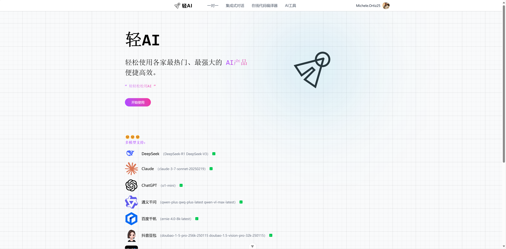
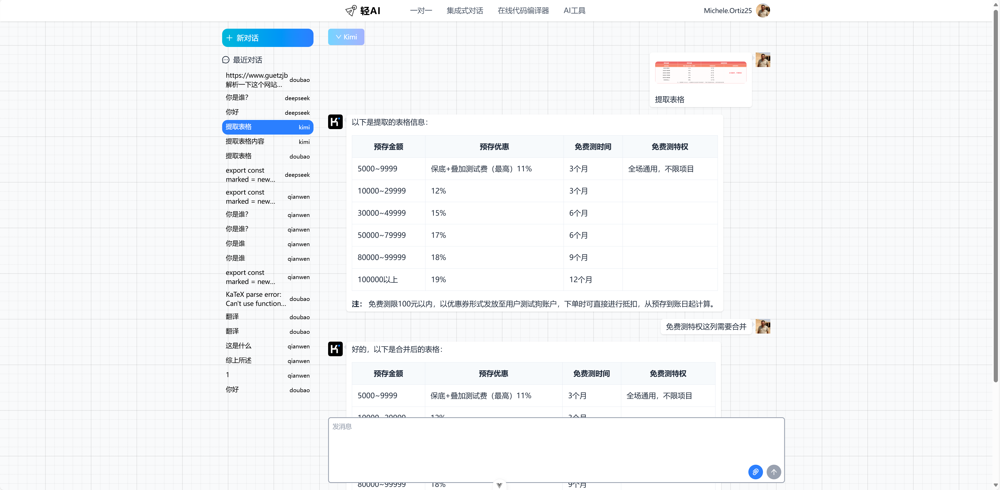
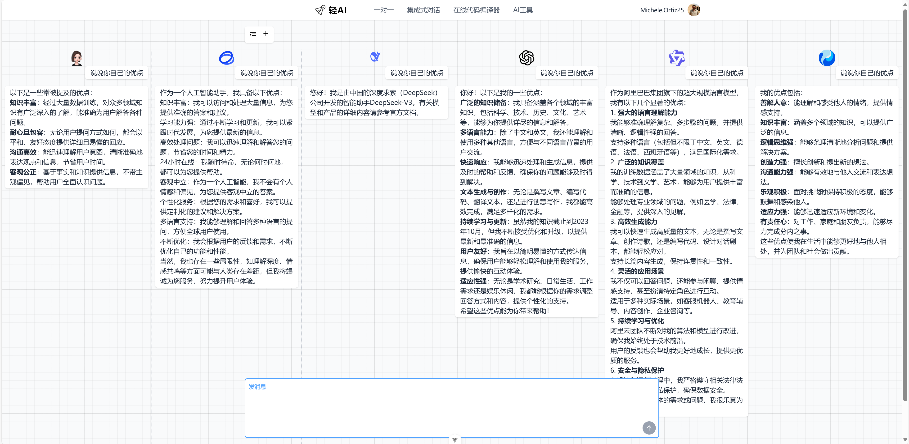
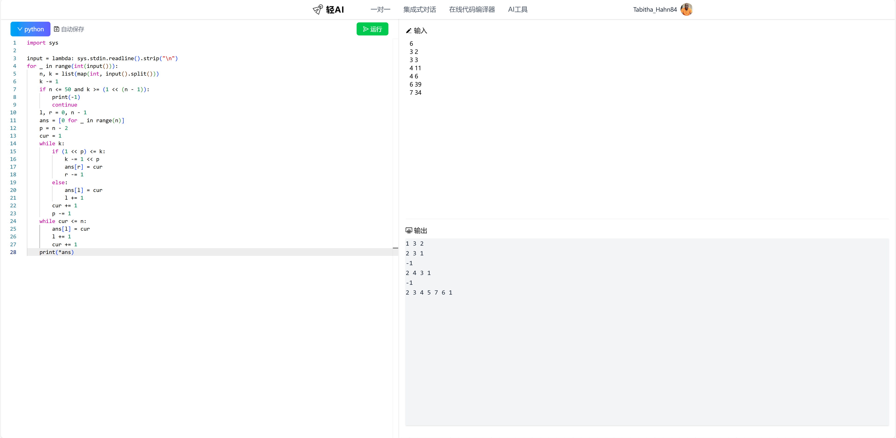
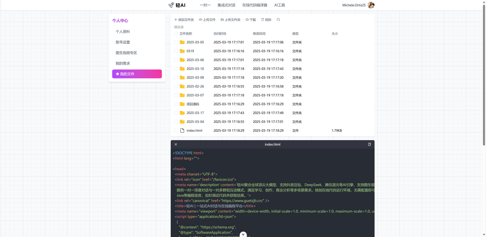

# 轻AI


轻AI——轻轻松松使用AI

一套基于Vue3 + Nestjs搭建的AI工具平台。[线上演示](https://www.guetzjb.cn/)

>轻AI聚合各平台顶尖大模型，支持DeepSeek、通义千问、豆包、ChatGPT、Claude等AI引擎，支持图生视频，Meta GPT提供一对一深度对话与一对集群式互动模式，满足学习、创作、商业分析等多场景需求。独创在线代码运行环境，无需配置即可直接执行Python、C++、Java等编程语言，实时调试代码并获取结果。

### 前言

我热爱AI、于是诞生此项目😊

### 项目结构

light-front 前端

light-admin 后端

light-front-back 后台(完善中)

### 项目功能概括

1、一对一AI聊天

其中Deepseek、通义千问具备思考模型（更多模型接入中）

其中通义千问、豆包、kimi接入多模态模型（更多模型接入中）

📕所有回答均可语音朗读

2、集成式AI聊天

🔸 跨模型协作舱：无限AI自由组队，思维碰撞无界限！

3、🛠️在线编译器（▶支持Java、Python、CPP，更多语言接入中）

4、⚡图生视频：静态图像→动态叙事

5、🤖MetaGPT多智能体协作

6、🗂️功能齐全的文件系统

### 接入大模型列表

| 模型名称 | 官方地址                                        |
| -------- | ----------------------------------------------- |
| Deepseek | https://www.deepseek.com                        |
| 通义千问 | https://www.aliyun.com/product/tongyi           |
| 文心一言 | https://ai.baidu.com                            |
| 豆包     | https://www.volcengine.com                      |
| Kimi     | https://platform.moonshot.cn/                   |
| GEMINI   | https://ai.google.dev/gemini-api/docs           |
| 智谱清言 | https://bigmodel.cn                             |
| 腾讯混元 | https://cloud.tencent.com/document/product/1729 |
| 阶跃星辰 | https://platform.stepfun.com                    |
| 百川智能 | https://platform.baichuan-ai.com/docs/api       |
| 科大讯飞 | https://www.xfyun.cn                            |
| ChatGPT  | https://api.deerapi.com 暂用                    |
| Claude   | https://api.deerapi.com 暂用                    |

### .env环境变量一览表

| 说明                          | KEY值                           |
| ----------------------------- | ------------------------------- |
| Deepseek                      | DEEPSEEK_API_KEY                |
| 通义千问                      | QIANWEN_API_KEY                 |
| 文心一言                      | QIANFAN_API_KEY                 |
| 豆包                          | DOUBAO_API_KEY                  |
| Kimi                          | KIMI_API_KEY                    |
| GEMINI                        | GEMINI_API_KEY                  |
| 智谱清言                      | ZHIPU_API_KEY                   |
| 腾讯混元                      | HUNYUAN_API_KEY                 |
| 阶跃星辰                      | YUEWEN_API_KEY                  |
| 百川智能                      | BAICHUAN_API_KEY                |
| 科大讯飞                      | XUNFEI_API_KEY                  |
| ChatGPT                       | DEER_API_KEY                    |
| Claude                        | DEER_API_KEY                    |
| OSS AK                        | ALIBABA_CLOUD_ACCESS_KEY_ID     |
| OSS SECRET                    | ALIBABA_CLOUD_ACCESS_KEY_SECRET |
| OSS REGION                    | ALIBABA_CLOUD_REGION            |
| OSS 配置的域名                | ALIBABA_CLOUD_CUSTOM_DOMAIN     |
| 示例127.0.0.1                 | MYSQL_HOST                      |
| mysql用户名                   | MYSQL_USERNAME                  |
| mysql密码                     | MYSQL_PASSWORD                  |
| redis IP+端口(127.0.0.1:6379) | REDIS_HOST                      |
| redis密码                     | REDIS_PASSWORD                  |
| 示例http://127.0.0.1          | DOCKER_NAME_HOST                |
| docker端口                    | DOCKER_NAME_PORT                |
| MetaGPT配置文件地址           | VIRTUAL_COMPANY_CONFIG_PATH     |

MetaGPT配置文件示例

```yaml
llm:
  api_type: "openai"
  model: "deepseek-chat"  # or gpt-3.5-turbo-1106 / gpt-4-1106-previewgit
  base_url: "https://api.deepseek.com/v1"  # or forward url / other llm url
  api_key: "你的API_KEY"
repair_llm_output: true

mermaid:
  engine: "nodejs"
  path: "mmdc"
  puppeteer_config: "/app/metagpt/config/puppeteer-config.json"
  pyppeteer_path: "/usr/bin/chromium"
```

### 对象存储

使用图片存储oss + 服务器存储

由于AI图生视频功能不允许图片加载速度过慢，如果使用存储在服务器中的图片URL可能会造成错误。

服务器存储，一个示例路径为/opt/files/${日期}/xxx.jpg，如遇图片无法访问可以在nginx上配置静态文件目录为/opt/files，匹配路径为/assets_other，随后形成www.example.com/assets_other/2025-03-19/2f097144-e948-4fd0-88aa-fb728c519a4f.jpg类似的路径。

### 安装步骤

> 建议node版本18+

```bash
#1. 克隆项目
git clone 

#2. 后端安装依赖
cd light-admin
pnpm install

#3. 前端安装依赖
cd light-front
pnpm install

#4.填写.env环境变量

#5.启动后端
cd light-admin
pnpm start:dev

#6.启动前端
cd light-front
pnpm dev

#现在已经可以通过http://localhost:3000访问到页面
```

注：在现代码运行依赖于docker环境，需要镜像openjdk:22、node、gcc，最好提前安装到本地（否则运行代码会自动安装，可能第一次运行较慢）

```bash
docker pull openjdk:22
docker pull node
docker pull gcc
```

注：AI工具——虚拟软件公司，依赖metagpt/metagpt:latest镜像，也最好提前安装到本地

```bash
docker pull metagpt/metagpt:latest
```

### 项目截图











如遇问题，欢迎提Issue